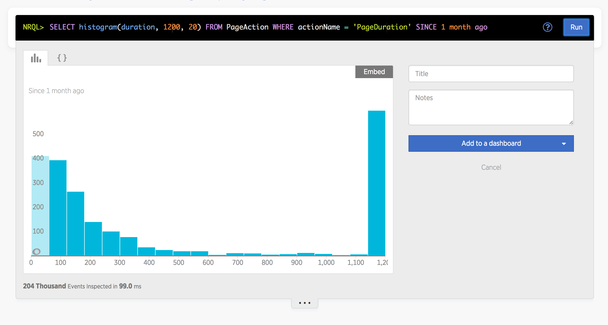

## Page Duration

This project will record page duration in [Insights][Insights] via the
[Browser][Browser] agent.

[Insights]: https://newrelic.com/insights
[Browser]: https://newrelic.com/browser-monitoring

### Usage

Install the package via npm:

~~~
npm install --save nr-page-duration
~~~

Be sure to require it in your code before compiling it:

~~~ javascript
require('nr-page-duration')
~~~

Lastly, check out the data in [Insights][Insights] via a query similar to:

~~~ sql
SELECT histogram(duration, 1200, 20) FROM PageAction WHERE actionName = 'PageDuration' SINCE 1 month ago
~~~

This will produce a graph similar to:

